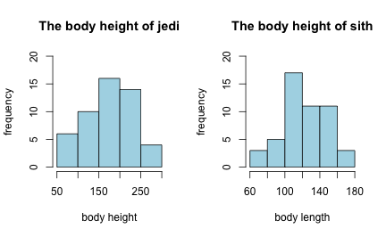
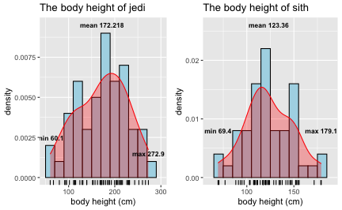
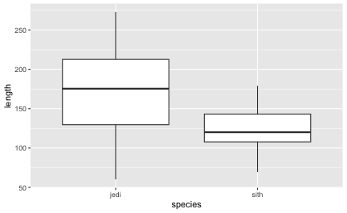
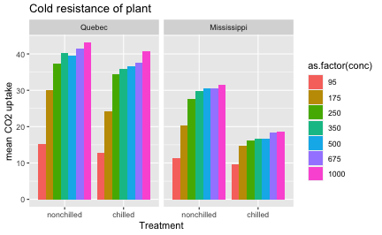
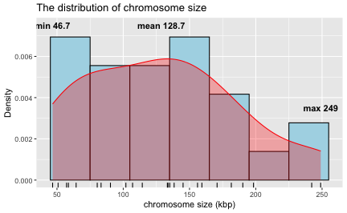
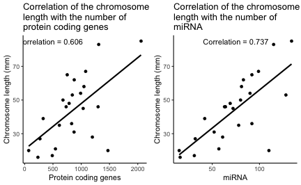
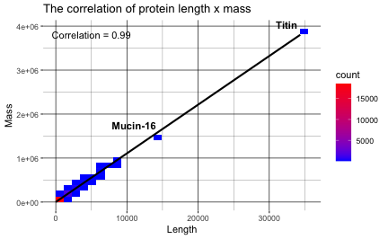

# Task 1 - Paper related

**2a.What is the medically relevant insight from the article?**

1.  WAT cells uniquely respond to insulin by inducing different sets of genes in three conditions: obese, post-obese, and healthy.

2.  There are sets of genes that are enriched in women undergone bariatric surgery, even though they showed the same BMI, HOMA, and M-value as healthy women (NO).

3.  In all three group studies, the genes play roles in lipid and cholesterol biosynthesis, nutrient sensing, and adipogenesis are comparable.

4.  The circadian rhythm of WAT is attenuated in obese condition, which may lead to the observed metabolic dysfunction in obesity. However, the attenuation of circadian rhythm could also be caused by irregular eating schedules and behaviors.

**2b.Which genomics technology/ technologies were used?**

Transcripts abundance using CAGE (Cap Analysis of Gene Expression)

**3a.List and explain at least three questions/ hypotheses you can think of that extend the analysis presented in the paper**

1.  What makes the white adipose tissue of POB became sensitive to insulin again?

Among all the gene sets listed in POB-enriched is ECM remodeling. Previous study has demonstrated that integrin, a cell surface protein regulating the organization of ECM, plays an active role in determining the sensitivity of WAT towards insulin (Ruiz-Ojeda et al.,2021). Extracting the integrin expression information from these 3 study groups will support the finding from previous study by explaining the integrin expression in 3 different conditions: obese, post-obese, and healthy.

2.  What are the outcomes for women who followed a strict diet to lose weight? Will we observe similar enriched gene sets as in post-obese (POB) women, or are these gene sets only observed in the post-obese condition?

3.  The dysregulation of circadian rhythm impacts the expanding capability and metabolic function of white adipose tissue.

This paper showed that circadian rhythm is one of the gene sets that are attenuated only in obese conditions. These findings align with several previous studies. In mice model, the proliferation of white adipose tissue follows the diurnal variation which is disrupted by high fat diet (Latre et al., 2021). Epidemiology study with a female night-shift worker showed that the frequency of night shift increased the risk obesity as measured by a high fat body percentage (Zhang et al.,2021). Nevertheless, while there is a clear link between the risk of obesity in night-shift workers and the functionality of white adipose tissue (WAT), it is yet to be demonstrated how WAT functions under conditions of circadian dysregulation. It is also interesting to observe the risk of POB who experiences jetlag or night shift has higher risk of being obese again. To further investigate this, we could collect a WAT sample from a night-shift worker or develop a night-shift mouse model. The assessment parameters should cover the markers of functionality of WAT, as well as the circadian rhythm.

Reference

Ribas-Latre, A., Santos, R.B., Fekry, B. et al. Cellular and physiological circadian mechanisms drive diurnal cell proliferation and expansion of white adipose tissue. Nat Commun 12, 3482 (2021). <https://doi.org/10.1038/s41467-021-23770-0>

Zhang, S.; Wang, H.; Wang, Y.; Yu, M.; Yuan, J. Association of Rotating Night Shift Work with Body Fat Percentage and Fat Mass Index among Female Steelworkers in North China. Int. J. Environ. Res. Public Health 2021, 18, 6355. <https://doi.org/10.3390/ijerph18126355>

Ruiz-Ojeda, F.J., Wang, J., Backer, T. et al. Active integrins regulate white adipose tissue insulin sensitivity and brown fat thermogenesis. Molecular Metabolism 45, 101147 (2021). <https://doi.org/10.1016/j.molmet.2020.101147>

# TASK 4 - Using R example datasets

**2.Describe briefly the content of the CO2 dataset using the help function**


```r
#load the data
data("CO2")
?CO2
```

The experiment is analyzing the cold tolerance of the grass species *Echinochola cruss-galli* by measuring the CO2 response curve for photosynthesis. The data contain the CO2 uptake at several levels of CO2 concentration in the chilled and non-chilled plants.

**3.What is the average and median CO2 uptake of the plants from Quebec and Missisipi?**


```r
library(tidyverse)
library(dplyr)
```


```r
#load the data
data(CO2)
```


```r
#calculate the mean for each Type of plants (Quebec and Mississippi)
tapply(CO2$uptake, CO2$Type, mean)
```

```
##      Quebec Mississippi 
##    33.54286    20.88333
```


```r
#calculate the median for each Type of plants (Quebec and Mississippi)
tapply(CO2$uptake, CO2$Type, median)
```

```
##      Quebec Mississippi 
##       37.15       19.30
```

# Task 5 - R Functions

**1. Write a function that calculates the ratio of the mean and the median of a given vector. This is a helpful measure to detect data with outlying values**

*symmetrically distributed if the ratio of the mean and median close to 1*


```r
x <- c(1:10)
ratio_mean_median <- function(x){
  mean_value <- mean(x, na.rm=TRUE)
  median_value <- median(x, na.rm=TRUE)
  ratio <- mean_value/median_value
  ratio
}
ratio_mean_median(x)
```

```
## [1] 1
```

```r
#na.rm=TRUE to handle missing value
```

*right-skewed data if the ratio of the mean and median is greater than 1*


```r
y <- c(1,2,3,4,50)
ratio_mean_median(y)
```

```
## [1] 4
```

*left-skewed data if the ratio of the mean and median is less than 1*


```r
z <-c(-2,30,31,32,33,34)
ratio_mean_median(z)
```

```
## [1] 0.8359788
```

**2. Write a function that ignores the lowest and the highest value from a given vector and calculate the mean**


```r
x <-c(1:6)
mean_without_max_min <-function(x){
  ignore_max_min <- x[c(-which.max(x), -which.min(x))]
  result<-mean(ignore_max_min)
  result
}
mean_without_max_min(x)
```

```
## [1] 3.5
```

**3. Short explanation about piping**

The pipe operator chains together a sequence of operation by passing the results as an input to the next operation, in a natural and logical order of thinking. The pipes are not recommended to use when the operation is simple (might add unnecessary complexity), too long (hard to debug), has multiple output/input, and the sequence doesn't match the logic.

**4. Short explanation about apply-family of functions (apply, lapply, sapply)**

These functions apply a specified function to selected rows or columns of matrices, data frame, and list. They offers flexibility and efficiency when dealing with large datasets, particularly during data preprocessing such as data cleaning, normalization, or summarizing the descriptive statistics.

# TASK 6- Basic visualization with R


```r
#load the package
library(tidyverse)
library(dplyr)
library(gridExtra)
```

## 1. Compare the distribution of the body height of the two species from the 'magic_guys' dataset graphically

**1a. Histogram**


```r
#load the data
magic_guys <- read.csv("/Users/agniavibriani/Downloads/magic_guys.csv")

#categorize based on species

jedi <- dplyr::filter(magic_guys, species == "jedi")
sith <- dplyr::filter(magic_guys, species == "sith")

#build histogram for the distribution of the body height of the two species using basic 'hist' function
#par function uses to show the graph side by side

par(mfrow=c(1,2))
plotJ <-hist(jedi$length, breaks =5,
             main="The body height of jedi",xlab="body height", ylab="frequency",
             border="black", col="lightblue", ylim=c(0,20))
plotS <- hist(sith$length, breaks=5, 
              main="The body height of sith", xlab = "body length", ylab="frequency",
              border = "black", col="lightblue", ylim=c(0,20))
```

<div class="figure" style="text-align: center">

<p class="caption">plot of chunk histogram</p>
</div>

**1a. ggplot**


```r
#Jedi

#Annotation information which contains the labels that will be displayed

annotation <- data.frame(
x=c(min(jedi$length), max(jedi$length), mean(jedi$length)),
#I determine the y position where the label will be displayed
y=c(0.0025, 0.0015, 0.0095), 
label=c("min", "max", "mean"))

#generate the plot. 

#fist row determines that I'm using "Jedi" datasheet from previous filtering.
#Second row determines geom_histo will be used with Y axis is a density. binwidth size is 20. 
#fill determines the color to be used for filling the bars and color is the color of border
#third row, I add geom_rug to show the location of individual data point
#fourth row,, I add density to show the density curve of the population
#fifth row, I add annotation for min, max, and mean. The annotation has been described before.
#sixth row, defining the title and x axis
#seventh row, adjusting the scale of x axis

ggplotjedi <- ggplot(jedi, aes(length))+
geom_histogram(aes(y=..density..), binwidth = 20, color="black", fill="lightblue")+
geom_rug()+
geom_density(color="red", fill="red", alpha=0.3)+
geom_text(data=annotation, aes(x=x, y=y, label=paste(label,x)), size=3, fontface="bold")+
labs(title = "The body height of jedi", x="body height (cm)")+ 
coord_cartesian(xlim=c(50,300))

#sith
# I use the same way as Jedi graph

annotation <- data.frame(
x=c(min(sith$length), max(sith$length), mean(sith$length)),
y=c(0.008, 0.008, 0.026),
label=c("min", "max", "mean"))

ggplotsith<-ggplot(sith, aes(length))+
geom_histogram(aes(y=..density..), binwidth = 10, color="black", fill="lightblue")+
geom_rug()+
geom_density(color="red", fill="red", alpha=0.3)+
geom_text(data=annotation, aes(x=x, y=y, label=paste(label,x)), size=3, fontface="bold")+
labs(title = "The body height of sith", x="body height (cm)")+
coord_cartesian(xlim = c(60,190))

#show the plot side by side

grobsJ <- ggplotGrob(ggplotjedi)
grobsS <- ggplotGrob(ggplotsith)
grid.arrange(grobsJ, grobsS, ncol=2)
```

<div class="figure" style="text-align: center">

<p class="caption">plot of chunk ggplot</p>
</div>

**1b. Boxplot**


```r
ggplot(magic_guys, aes(species, length))+
geom_boxplot()
```

<div class="figure" style="text-align: center">

<p class="caption">plot of chunk boxplot</p>
</div>

Based on the histogram of heights data of jedi and sith, both species have a normal distribution. The body heights of jedi species has an average 172.22 cm, while the sith species has an average 123.36 cm. Although from the boxplot it looks like both species has skewed distribution, however the number and the position of outliers are not significant to affect the distribution.

**1c. Save the plots with png, pdf, and svg formats. In which situation would you use that format?**

PNG = creating graph for digital publication.

PDF = mostly use for creating document, such as LaTeX.

SVG = if the editing process is needed after saving the image. PNG and PDF are vectorized images, which means they can be rescaled without lowering the quality.

## 2. The gene expression data matrix from the 'microarray_data.tab'

**2a. How big is the matrix in terms of row and columns?**

553 rows and 1000 columns

**2b. Count the missing values per gene and visualize this result**


```r
library(readr)
microarray_data <- read_delim("/Users/agniavibriani/Downloads/microarray_data.tab", delim = "\t", escape_double = FALSE,trim_ws = TRUE)

#count the missing value in each column and produce the result as a data frame
#the data frame consists of 1000 row as a gene and 1 column as a total count of missing value (I named it as value)
missing_value <- data.frame(Value = colSums(is.na(microarray_data)))

#generate a bar graph
#first row = determine data frame. The x axis will follow the row names, and levels is to ensure the order follow the data frame.
#second row = determine the type of geom. Stat 'identity' uses to specify the　Y value　follow the value column in data frame.
#third row = label the x,y axis and the title.
#forth row = minimal theme is used.
#fifth row = axis.text.x to specify the x-axis label appearance. 'element_text' to rotate the X-axis label text by 45 deg and adjust their horizontal justification to 1.
#sixth row = customize the x-axis scale. It sets the thick marks and label with a sequence every 50 rows.

ggplot(missing_value, aes(x = factor(rownames(missing_value), levels = rownames(missing_value)), y = Value)) +
geom_bar(stat = "identity", fill = "black") +
labs(title = "Total missing value in each gene", x = "Gene", y = "Count") +
theme_minimal() +
theme(axis.text.x = element_text(angle = 45, hjust = 1)) +
scale_x_discrete(breaks = rownames(missing_value)[seq(1, nrow(missing_value), by = 50)], 
labels = rownames(missing_value)[seq(1, nrow(missing_value), by = 50)])
```

<div class="figure" style="text-align: center">

<p class="caption">plot of chunk bar chart</p>
</div>

**2c. Find the genes for which there are more than X% (X=10,20,50%) missing value**


```r
#calculate missing percentage by using Apply family. 
#Describe the function  --> use apply family to calculate the percentage for each row --> transform to data frame
calculate_percentage <- function(x){(x/553)*100} 
percentage <-apply(missing_value, MARGIN=1, FUN = calculate_percentage)
missing_percentage<-data.frame(percentage)

#Find the genes for which there are more than 10
Missing_10 <-missing_percentage%>%
  filter(missing_percentage>10)%>%
  nrow()
Missing_10
```

```
## [1] 512
```

Find the genes for which there are more than 20% missing values


```r
Missing_20 <-missing_percentage%>%
  filter(missing_percentage>20)%>%
  nrow()
Missing_20
```

```
## [1] 377
```

Find the genes fpr which there are more than 50% missing values


```r
Missing_50 <-missing_percentage%>%
  filter(missing_percentage>50)%>%
  nrow()
Missing_50
```

```
## [1] 74
```

**2d. Replace the missing values by the average expression value for the particular gene**


```r
new_microrray <- microarray_data%>%
mutate_all(~ifelse(is.na(.), mean(., na.rm=TRUE),.))
head(new_microrray)
```

```
## # A tibble: 6 × 1,000
##        g1    g2     g3      g4      g5     g6     g7     g8     g9    g10    g11    g12    g13     g14    g15
##     <dbl> <dbl>  <dbl>   <dbl>   <dbl>  <dbl>  <dbl>  <dbl>  <dbl>  <dbl>  <dbl>  <dbl>  <dbl>   <dbl>  <dbl>
## 1  1.80   0.166 -0.182  1.31    3.50    0.439  0.777  0.379  0.336  0.877 -0.016  0.977  0.114  1.41   -0.131
## 2  0.0255 0.166  7.69  -0.0673  0.193  -1.38  -1.31  -0.424 -0.27  -0.519  1.45   0.229 -0.079  0.0651  0.402
## 3  1.08   0.166  1.56   1.65   -0.0181  0.46   0.715  0.375 -0.138 -0.261  0.207  0.154 -0.066  0.215   0.38 
## 4  3.61   0.166  1.91  -0.0673  1.4     1.11   2.14   1.57  -0.271 -0.309 -0.658 -0.089  0.421 -0.075   1.04 
## 5 -1.7    0.166  0.943 -0.0673 -0.17   -0.157 -0.041 -0.177 -0.069  1.53   0.177  0.461  0.228  0.025   0.299
## 6  0.0255 0.166  0.043 -0.0673  0.729  -0.089  0.209 -0.308  0.474 -0.655  0.249 -0.433  0.361 -0.603  -0.28 
## # ℹ 985 more variables: g16 <dbl>, g17 <dbl>, g18 <dbl>, g19 <dbl>, g20 <dbl>, g21 <dbl>, g22 <dbl>, g23 <dbl>,
## #   g24 <dbl>, g25 <dbl>, g26 <dbl>, g27 <dbl>, g28 <dbl>, g29 <dbl>, g30 <dbl>, g31 <dbl>, g32 <dbl>, g33 <dbl>,
## #   g34 <dbl>, g35 <dbl>, g36 <dbl>, g37 <dbl>, g38 <dbl>, g39 <dbl>, g40 <dbl>, g41 <dbl>, g42 <dbl>, g43 <dbl>,
## #   g44 <dbl>, g45 <dbl>, g46 <dbl>, g47 <dbl>, g48 <dbl>, g49 <dbl>, g50 <dbl>, g51 <dbl>, g52 <dbl>, g53 <dbl>,
## #   g54 <dbl>, g55 <dbl>, g56 <dbl>, g57 <dbl>, g58 <dbl>, g59 <dbl>, g60 <dbl>, g61 <dbl>, g62 <dbl>, g63 <dbl>,
## #   g64 <dbl>, g65 <dbl>, g66 <dbl>, g67 <dbl>, g68 <dbl>, g69 <dbl>, g70 <dbl>, g71 <dbl>, g72 <dbl>, g73 <dbl>,
## #   g74 <dbl>, g75 <dbl>, g76 <dbl>, g77 <dbl>, g78 <dbl>, g79 <dbl>, g80 <dbl>, g81 <dbl>, g82 <dbl>, …
```

**3. Visualize the data in the CO2 dataset in a way that gives you a deeper understanding of the data. Explain**


```r
data(CO2)

#generate the graph
ggplot(CO2, aes(y=uptake, x=Treatment, fill=as.factor(conc)))+
geom_bar(stat = "summary", fun="mean", position = "dodge")+
facet_wrap(.~Type)+
labs(x="Treatment", y="mean CO2 uptake", title="Cold resistance of plant")
```

<div class="figure" style="text-align: center">

<p class="caption">plot of chunk CO2</p>
</div>

There are several conclusions can be taken from above graph:

1.  Generally, the plant from Quebec has higher CO2 uptake compared with the plant from Mississippi.

2.  Both plants exhibit similar CO2 uptake behavior at different levels of CO2 availability. The CO2 uptake is increasing in line with the higher levels of CO2 availability. However, the Mississippi plant showed a less pronounced increase at the higher levels of CO2 availability (350, 500, 675,1000).

3.  The plant from Quebec shows better cold resistance compared to the plant from Mississippi. Cold temperature significantly reduces CO2 uptake in Mississipi plant.

# TASK 7 - Tidybiology

**1a. Extract summary statistics (mean, median, maximum) for the following variable from the chromosom data: variations, protein, coding genes, and mRNA**


```r
#load the package needed
library(tidyverse)
library(gridExtra)
library(tidybiology)
data("chromosome")
```


```r
#Extract the summary statistics of chromosome data for selected columns (variations, protein_codinggene, mi_rna)
variable<-chromosome%>%
select(variations, protein_codinggenes, mi_rna)
summary(variable)
```

```
##    variations       protein_codinggenes     mi_rna      
##  Min.   :  211643   Min.   :  71.0      Min.   : 15.00  
##  1st Qu.: 4395298   1st Qu.: 595.8      1st Qu.: 55.75  
##  Median : 6172346   Median : 836.0      Median : 75.00  
##  Mean   : 6484572   Mean   : 850.0      Mean   : 73.17  
##  3rd Qu.: 8742592   3rd Qu.:1055.5      3rd Qu.: 92.00  
##  Max.   :12945965   Max.   :2058.0      Max.   :134.00
```

**1b. How does the chromosome size distribute?**

```r
#Add kilobasepair column 
new_chromosome <-chromosome%>%
mutate(kbp=basepairs/1000000)

#Annotation to ggplot
annotation <-data.frame(x=c(round(min(new_chromosome$kbp),1), round(max(new_chromosome$kbp),1), round(mean(new_chromosome$kbp),1)),
y=c(0.0075, 0.0035, 0.0075),
label=c("min", "max", "mean"))

#generate the distribution graph
ggplot(new_chromosome, aes(kbp))+
geom_histogram(aes(y=..density..), color="black",fill="lightblue", binwidth =30)+
geom_rug()+
geom_density(color="red", fill="red", alpha=0.3)+
geom_text(data=annotation, aes(x=x, y=y, label=paste(label,x)), fontface="bold")+
labs(title = "The distribution of chromosome size", x="chromosome size (kbp)", y="Density")   
```

<div class="figure" style="text-align: center">

<p class="caption">plot of chunk distribution</p>
</div>

According to this graph, the distribution of chromosome size is right-skewed, where most of the chromosome has a size around 46-200 kbp. 

**1c. Does the number of protein coding genes or miRNA correlate with the length of the chromosome?**

```r
#Calculate the correlation
corPL <- cor(chromosome$protein_codinggenes, chromosome$length_mm)
corPL
```

```
## [1] 0.6060185
```

```r
corML <- cor(chromosome$mi_rna, chromosome$length_mm)
corML
```

```
## [1] 0.7366973
```


```r
#define the title 
titlePL <-str_wrap("Correlation of the chromosome length with the number of protein coding genes", width=30)
titleML <-str_wrap("Correlation of the chromosome length with the number of miRNA", width=30)

#generate the graph
plotProtein <- ggplot(chromosome, aes(x = protein_codinggenes, y = length_mm)) +
geom_point() +
geom_smooth(method = lm, color="black", se=FALSE)+
labs(title = titlePL, x="Protein coding genes", y="Chromosome length (mm)")+
theme_classic()

plotMiRNA <- ggplot(chromosome, aes(x = mi_rna, y = length_mm)) +
geom_point() +
geom_smooth(method = lm, color="black", se=FALSE)+
labs(title = titleML, x="miRNA", y="Chromosome length (mm)")+
theme_classic()

#Give the correlation information on the graph
plotPL <- plotProtein + annotate("text", x=450, y=max(chromosome$length_mm), label="Correlation = 0.606")
plotML <-plotMiRNA + annotate("text", x=75, y=max(chromosome$length_mm), label="Correlation = 0.737")

grid.arrange(plotPL, plotML,ncol=2)
```

<div class="figure" style="text-align: center">

<p class="caption">plot of chunk chromosome</p>
</div>

According to this graph, length of the chromosome shows moderately positive correlation (correlation coefficient > 0.5) with the number of protein coding genes and miRNA. 

**1d. Calculate the summary statistics for the protein data variables length and mass. And create the correlation plot between two parameters**


```r
data("proteins")
variable<-proteins%>%
select(length,mass)
summary(variable)
```

```
##      length             mass        
##  Min.   :    2.0   Min.   :    260  
##  1st Qu.:  251.0   1st Qu.:  27940  
##  Median :  414.0   Median :  46140  
##  Mean   :  557.2   Mean   :  62061  
##  3rd Qu.:  669.0   3rd Qu.:  74755  
##  Max.   :34350.0   Max.   :3816030
```

Plot the correlation between proteinlength and protein mass

```r
#calculate the correlation
cor(proteins$length, proteins$mass)
```

```
## [1] 0.9991674
```

```r
#generate the plot
proteinplot<- ggplot(proteins, aes(x = length, y = mass)) +
stat_bin2d()+
scale_fill_gradient(low="blue", high="red")+
geom_smooth(method = lm, color="black")+
labs(title = "The correlation of protein length x mass", x="Length", y="Mass")+
theme(
panel.grid.major=element_line(color="black", linewidth = 0.3),
panel.grid.minor=element_line(color="black", linewidth = 0.1),
panel.background = element_rect(fill="white"))

#label the selected protein
selected_points <-proteins[proteins$protein_name%in% c("Mucin-16 ","Titin "), ]
proteinplot+geom_text(data=selected_points, aes(label=protein_name), vjust=-0.8, hjust=1, size=4, fontface="bold")+
  annotate("text", x=5000, y=max(proteins$mass), label="Correlation = 0.99")
```

<div class="figure" style="text-align: center">

<p class="caption">plot of chunk protein</p>
</div>
According to this graph, the correlation between protein length and mass is strongly positive (0.99). Also, we could see that two proteins, Mucin-16 and Titin, larger in size compared with the rest. We also could log10 all the variables to make each point not overlap. 
